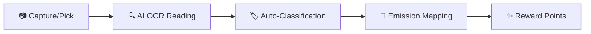

# 🌿 Smart Carbon Tracking

## *The Next-Generation AI Carbon Monitoring System*

Smart Carbon Tracking is more than just a scanner; it's a high-fidelity companion designed to transform every purchase into a conscious environmental decision. By leveraging sophisticated OCR and real-time emission mapping, we empower users to Visualize, Track, and Reduce their carbon footprint.

---

## 🎨 Design Philosophy: "Premium & Purposeful"

We believe that saving the planet should feel as modern as the future we're trying to build.

- **Glassmorphism**: Subtle blurs and layers for depth.
- **Aesthetic Dark Mode**: Curated HSL colors to reduce eye strain and look premium.
- **Micro-Animations**: Providing delightful feedback for every scan and pick action.
- **Ergonomics**: One-handed navigation with the integrated bottom "Action Dock".

---

## 🚀 Core Features & Capabilities

### 1. Smart Receipt Orchestration

The scanning module uses a custom-built camera overlay that guides the user to align receipts perfectly. This ensures high-quality data for the upcoming OCR engine.

### 2. High-Fidelity Gallery Selector

Integrated with a robust validation system:

- **Strict Validation**: Only supports high-res `.jpg`, `.jpeg`, and `.png`.
- **Performance Optimized**: Automatic rejection of files larger than 5MB to ensure snappy analysis.

### 3. Integrated Point Rewards

Every "Green Choice" identified in a receipt translates into points, gamifying the conservation effort.

---

## 📅 Roadmap 2026

- [x] **Phase 1**: UI/UX Foundation & Design System.
- [x] **Phase 2**: Modular Navigation & Orchestration.
- [x] **Phase 3**: Image Picking & Validation Logic (Current).
- [ ] **Phase 4**: GPT-Powered Receipt Item Extraction.
- [ ] **Phase 5**: Dynamic Carbon Graph & Personal Dashboard.
- [ ] **Phase 6**: Social "Green" Leaderboard.

---

## 🏗️ Technical Architecture

This project follows a specialized **Clean Architecture** combined with the **Controller Pattern**:

- **Presentation Layer**: Using pure stateless widgets and `Consumer` for reactive UI.
- **Controller Layer**: Decoupled business logic from UI using `Provider` (ChangeNotifier).
- **Core Layer**: Centralized themes and spacing tokens for global consistency.

---

## 👨‍💻 Development Progress Summary

| Module | Features | Status |
| :--- | :--- | :---: |
| **Theme** | Dynamic Colors, Custom Fonts, Spacing Tokens | ✅ |
| **Nav** | Salomon Bottom Bar Orchestration | ✅ |
| **Scanner** | Custom Overlay, Mock Camera, Toolbar | ✅ |
| **Logic** | ScanController (Provider), Picker Handler | ✅ |
| **Data** | Model Scema (Planned), OCR Pipeline | 🚧 |

---

## 🔄 The Carbon Journey

---

## 🔐 Privacy & Data Handling

We respect your data. Our scanning process is designed with privacy in mind:

- **Local Validation**: File size and format checks happen entirely on-device.
- **Secure Transmission**: Images are processed via encrypted SSL channels.
- **No Permanent Storage**: Receipt images are used for analysis and can be deleted immediately after verification.

---

## 🧪 Scientific Foundation

The emission factors used in this application are derived from globally recognized environmental databases, ensuring your tracking is backed by science:

- **IPCC**: Intergovernmental Panel on Climate Change.
- **DEFRA**: UK Government conversion factors for greenhouse gas reporting.
- **EPA**: Environmental Protection Agency standards.

---

## 📱 Device Requirements

To ensure the best experience with our premium UI and real-time scanning:

- **Android**: Version 8.0 (Oreo) or higher.
- **iOS**: Version 13.0 or higher.
- **Camera**: Minimum 12MP with Auto-focus support.
- **Memory**: 4GB RAM minimum for smooth "Glassmorphism" rendering.

---

## 📥 Getting Started

1. Clone the repo: `git clone [your-repo-link]`
2. Initialize: `flutter pub get`
3. Run: `flutter run`

---

*“Measuring the world's impact, one receipt at a time.”*

